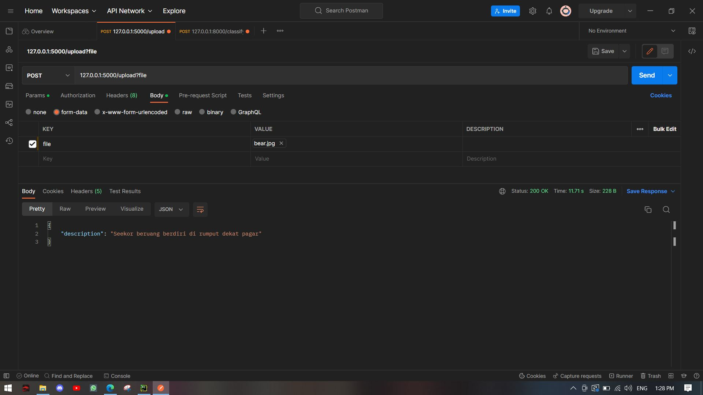

# Image Caption Generator (Bahasa Indonesia)

- Download [Caption and Instances Files](https://drive.google.com/drive/folders/1ZqGpIW4DL1Rg_-MMA5lKvvtBJgppies6?usp=sharing)
- Make virtual env 
```
python -m venv [env_name]
```
- install requirements
```
pip install -r requirements.txt
```
- image example


- run command
```
python img_capt.py [image_path]
```
- result
```
Seorang pria mengendarai sepeda motor di jalan
```

# Flask API
- go to the root folder and run API
```
flask run
```
- example image


- upload image to api


